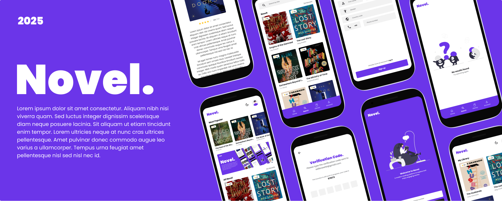

## Novel App

  

## Welcome! 👋

A project to practice building apps using Flutter.

## System Requirements 💻

| Type | Details                                  |
| ---- | ---------------------------------------- |
| 1.   | Flutter SDK                              |
| 2.   | Git                                      |
| 3.   | Integrated Development Environment (IDE) |

## How to Set Up 🔥

1. Clone the repository.
2. Navigate to the project directory: `cd novel_app`.
3. Run `flutter pub get`.
4. Now you can run the project.

## Features ⚡

This project contains the following main features:

- **Authentication Screen**: Log in, sign up, and OTP verification screens.
- **Home Screen**: Displays a list of novels fetched from an API.
- **Details Screen**: Shows detailed information about each novel.
- **Search Screen**: Search functionality to filter novels by title.
- **Library Screen**: Offline support using the `get_storage` package.
- **Error Screen**: Displays a proper UI for network or API issues.

## Technical Requirements Implemented 🔧

- **API Integration**: Uses the `http` package to handle API requests.
- **State Management**: Implements state management using the `GetX` package.
- **Navigation**: Uses `GetX's routing` system with named routes.
- **Responsive Design**: Utilizes the `flutter_screenutil` package to ensure a responsive design.
